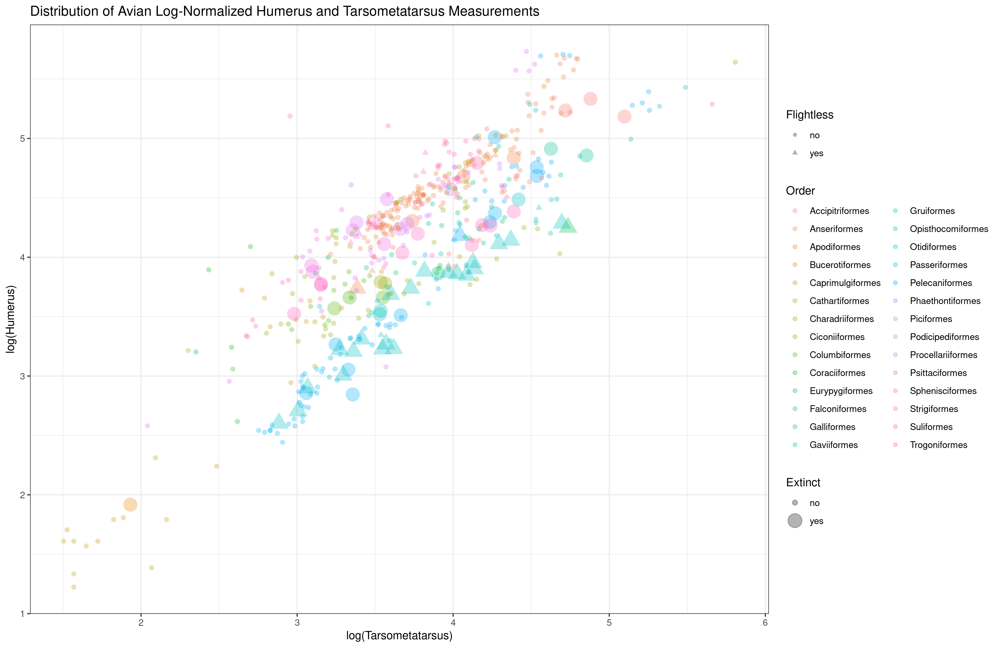
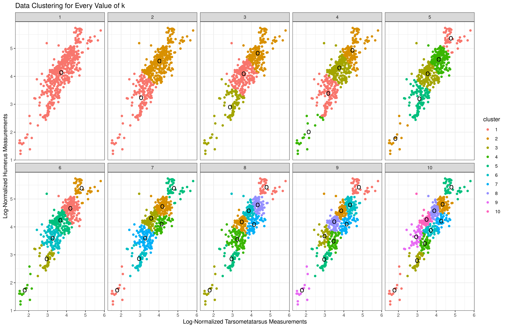
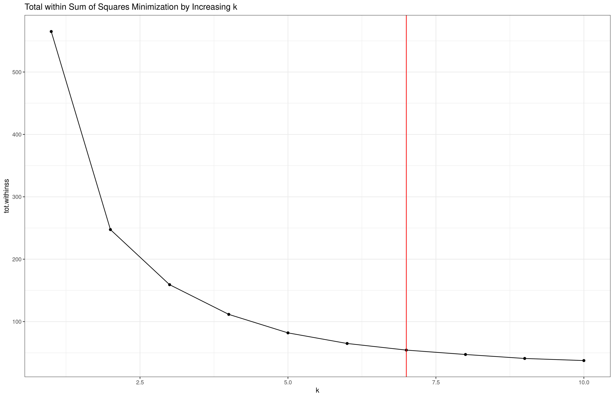
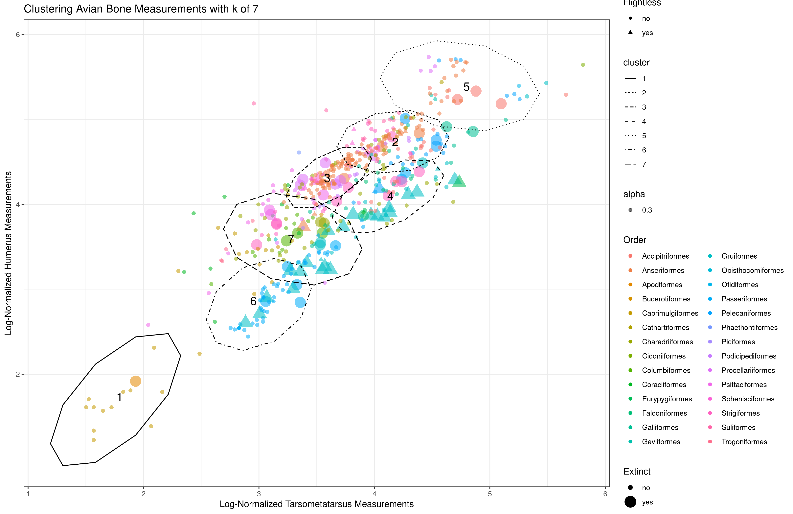

Introduction
============

  In this study I reanalyze the paper by @fromm_big_2021 wherein the authors aggregated body size measurements, flightlessness, order, and habitat of 9000 bird species with a focus on identifying size trends between extant species and species driven to extinction by human intervention. @fromm_big_2021 found a significant difference between extinct and extant birds in overall body size and other factors, concluding that species driven to extinction tended to be larger, flightless, and island-dwelling. 

  My aim is to see if those trends hold up in the body size data itself; i.e., can an unsupervised learning approach naively discover these same trends. Specifically, I use k-means clustering as implemented in the tidymodels R package [@kuhn_tidymodels_2020]. 

Results
============

  Before performing k-means clustering, I first cleaned the data, and then selected variables to use later. I found that much of the data was unavailable, so I chose two bone measurements with the most overlapping available data points that included both extinct and extant species. These bone measurements being for humerus and tarsometatarsus. 
  
  Following data filtering I then visualized the remaining data to see if there were any obvious trends across extinction status, flightlessness, or order. Axes were log-normalized for inter-specific comparisons. No evident trends were visible previous to clustering (Figure 1). 

```{r figure1, echo = FALSE, out.width="100%", fig.cap = 'Distribution of size measurements for extinct and extant bird species with flightlessness, Order, and extinction status. Tarsometatarsus measurements are on the x-axis and Humerus measurements are on the y-axis'}

```

  To identify the optimal number of k-means to describe the patterns in the data, I then performed k-means analysis, varying the k value from one to ten (Figure 2). 
  
```{r figure2, echo=FALSE, out.width="100%", fig.cap='Clustered size measurement data with varying values of k. Circles represent cluster centers'}

```

  To quantify how optimal each k-means value was, I calculated the total within sum of squares for each value k for the model. The lowest value k that minimized the total within sum of squares was seven (Figure 3).

```{r figure3, echo=FALSE, out.width="100%", fig.cap='Total within sum of squares for varying k values. The red line intersects at a k of seven'}

```

  Finally, I plotted the clusters with a k of seven overlaid onto Figure 1 to identify if there were any trends within the clusters. No noticeable trends were evident in the data (Figure 4).
  
```{r figure4, echo=FALSE, out.width="100%", fig.cap='Distribution of bird measurements with clusters overlain as ellipses and numbers at cluster centers'}

```

Methods
============

  Body size measurements data was downloaded from data dryad entry 10.5061/dryad.1rn8pk0tb via R script. The groundhog package was used for package version management and library control. Exploratory data analysis was carried out using the tidyverse R package [@tidy]. Data was loaded into R using the readxl package, filtered for NA values using dplyr and coerced using base R [@read] [@dplyr]. Variables for k-means clustering were chosen based on availability of data; the two variables with the most overlapping available values were chosen for downstream analysis. K-means clustering was performed using the tidymodels R package [@kuhn_tidymodels_2020]. Model variables were tidied and gathered using the broom R package [@broom]. Data was plotted using ggplot2 [@ggplot].
  
Discussion
=============

  In the original paper the authors found that birds driven to extinction by humans were more likely to be larger, flightless, and live on islands [@fromm_big_2021]. In this analysis I aimed to recreate these findings with an unsupervised learning approach. However, I was unable to do so. One possible explanation is the data points I used. In my analysis I filtered much of the data and ended up only using two data points; Humerus and Tarsometatarsus measurements. Because these two data points are correlated, it is possible that other relationships in the data were not able to be elucidated from this specific combination. 
    Additionally, the authors reached those conclusions by aggregating the size measurements into a single measurement of estimated body size [@fromm_big_2021]. They estimated bird body size by employing a linear regression model using data from all the measurements they gathered to allow for an even comparison between extinct and extant species [@fromm_big_2021]. This esimated body mass metric was then used in their statistical analysis to compare extinct and extant birds and how they came to their conclusions. My analysis did not use estimated body mass, so it is possible that this is the reason I was unable to come to the same conclusions.
    In the future, one could attempt to employ a different unsupervised approach such as a random forest model using the same estimated body mass measurements to see if that could recreate their results.

Conclusion
=============

  In this study I aimed to recreate the results of @fromm_big_2021 using an unsupervised k-means clustering approach but was unable to come to the same conclusions. Future studies can employ alternative models using different parts of the data to improve upon my analysis.
